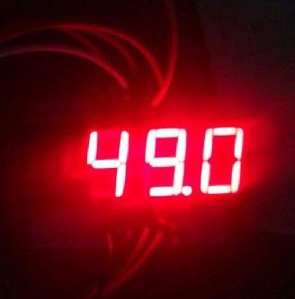
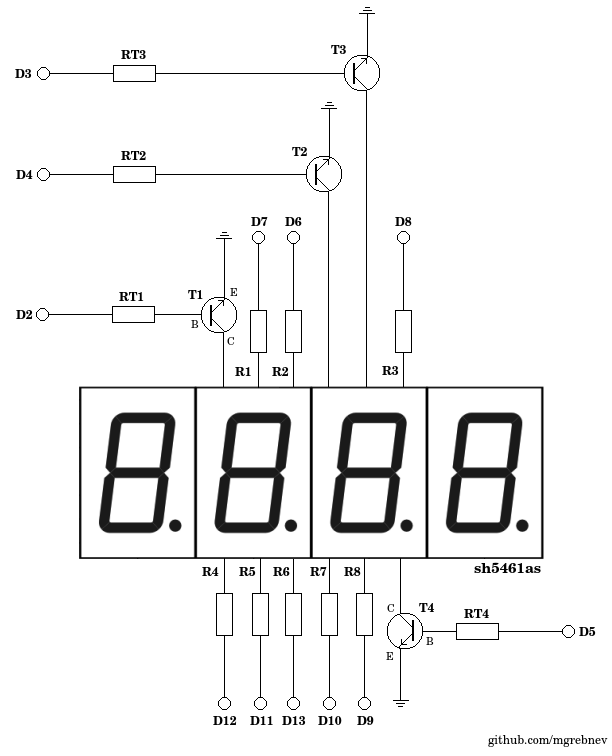
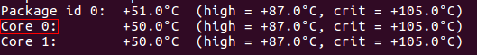
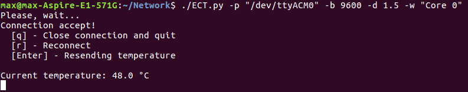
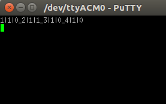
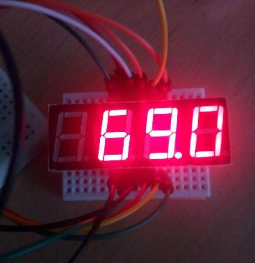

# Electronic CPU Thermometer v1.0.1

ECT allows you to transfer the temperature value of the CPU or any other PC components to a simple four-segment LED display 

### Schematic diagram

T1-T4 - 2N2222 or any NPN transistor
RT1-RT4 - 4.7K OHM resistor
R1-R8 - 400-500 OHM resistor (recommended 470 OHM)
LED display - sh5461as

### How to use

##### Prepare environment for Debian(Ubuntu) 
For correct work main script python 2.7 required. Also need install package for get sensor data and python module to work with serial port:

     # apt-get install lm_sensors
     # pip install pyserial

Next, run sensors app and choose the first words of the required line:

For example choose Core 0. Next, connect the device to USB and run main script

### Script arguments
      -p   Port to which the device is connected
      -d   Delay between repeat temperature sending
      -b   Data transfer speed
      -w   First words of the required line

### Data transfer protocol
###### PROTOCOL

    Begin digit - SYMBOL|ACTIVE|DOT_
    End digit - SYMBOL|ACTIVE|DOT\r\n

###### SYMBOL ACCEPT DATA:

     SYMBOL    LED SYMBOL
    0,...,9  -  0,...,9
         10  -  "-"

###### Example
    Number - "-1.23" - [ 10|1|0_1|1|1_2|1|0_3|1|0 ]
    Number - "56.3"  - [  0|0|0_5|1|0_6|1|1_3|1|0 ]

Fox example, hardcode PuTTY connect and enter "12.34" 

When Intelij IDEA run default Java "Hello, World" project :D

    
    
